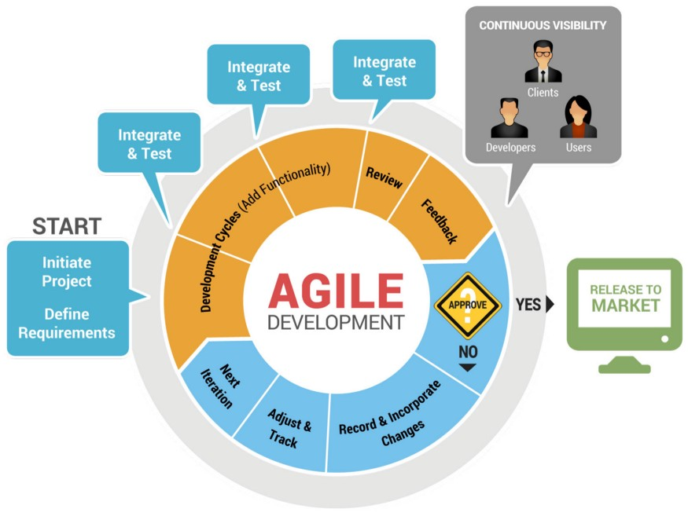

# Model Agile

Model Agile merupakan metode pengembangan software jangka pendek yang memerlukan adaptasi cepat dan pengembangan terhadap perubahan dalam bentuk apapun.

## Tujuan Agile

* High – value & working app system                                                                                            
Menghasilkan produk dengan kualitas yang baik, dan memiliki nilai jual yang tinggi.

* Cost control & value – driven development                                                                                    
Pengembangan perangkat lunak dapat sesuai dengan kebutuhan pengguna dan tim dapat dengan cepat merespon kebutuhan, sehingga waktu dan biaya pembuatan dari perangkat lunak dapat dikendalikan.

* High – quality production                                                                                                  
Kualitas dari perangkat lunak tetap terjaga, meskipun waktu dan biaya lebih sedikit.

* Flexible & risk management                                                                                                  
Meminimalisir terjadinya kesalahan pada program ataupun produk sebelum dilakukannya proses deploy aplikasi.

* Collaboration                                                                                                                
Kolaborasi ini dilakukan oleh setiap tim pengembang untuk mendiskusikan feedback yang diberikan oleh klien.

* Self – organizing, self – managing teams                                                                                         
Pengembang diberikan akses untuk memanajemen sendiri urusan software development. Seorang manajer hanya bertugas sebagai penghubung antara pengembang dengan klien sehingga dapat mengurangi terjadinya miss communication.

## Nilai atau Poin penting metode agile

Beberapa poin penting dalam metode agile adalah: 

1. Interaksi antar personal lebih penting daripada proses dan alat.                                              
2. Software yang berfungsi lebih penting daripada dokumentasi yang lengkap.                                                    
3. Kolaborasi dengan klien lebih penting daripada negoisasi kontrak.                                                         
4. Sikap tanggap lebih penting daripada mengikuti rencana/plan.                                                                  